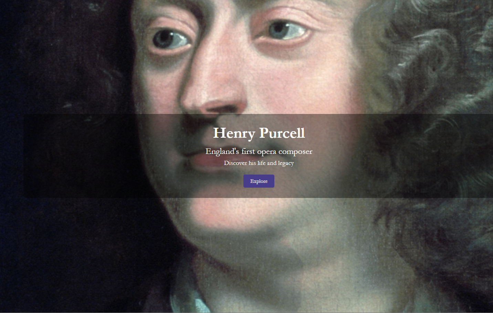
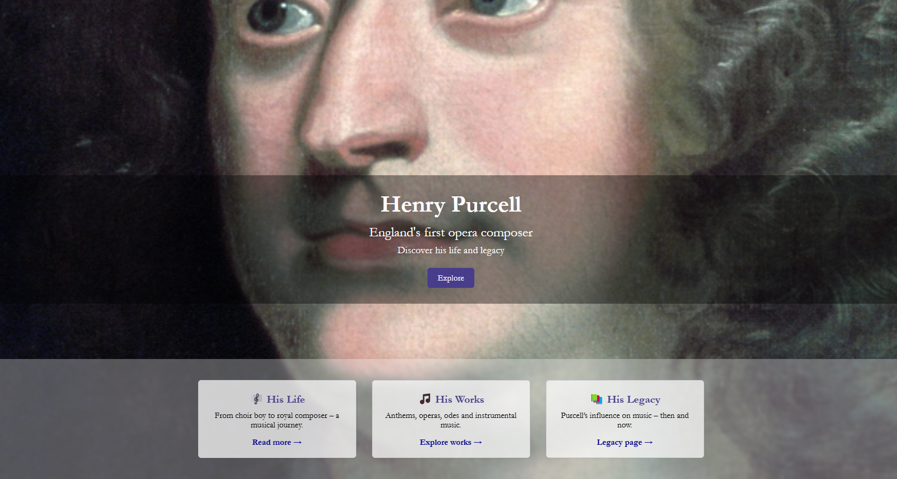
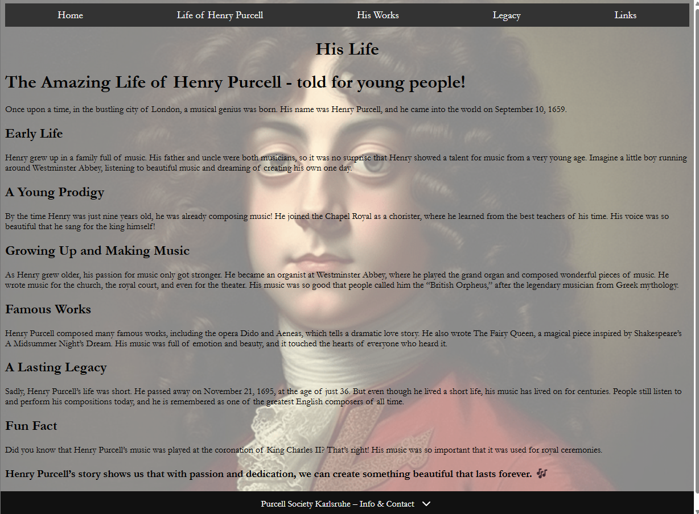
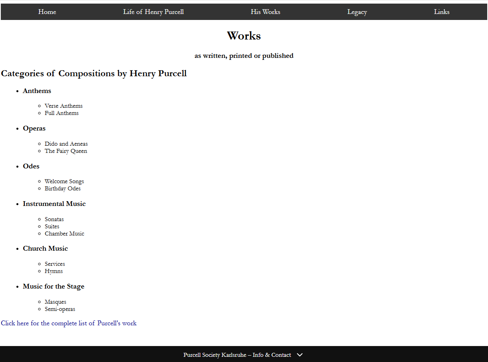
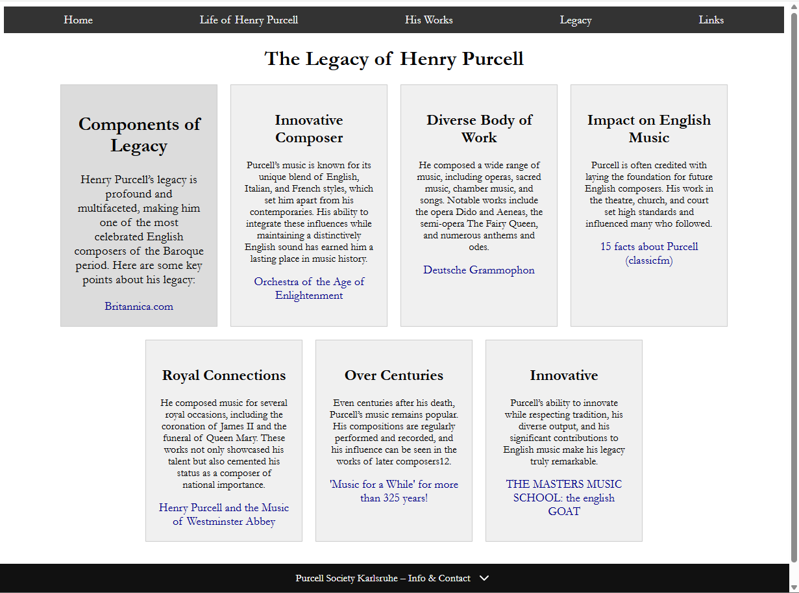
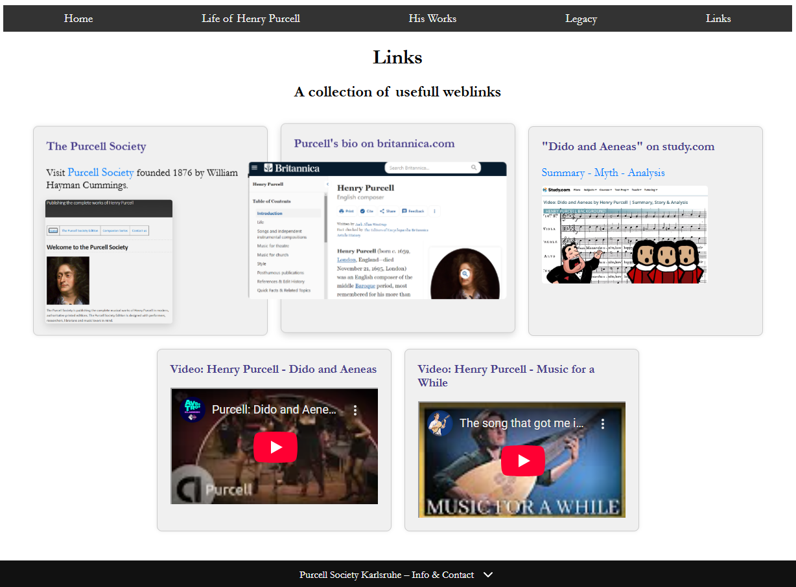
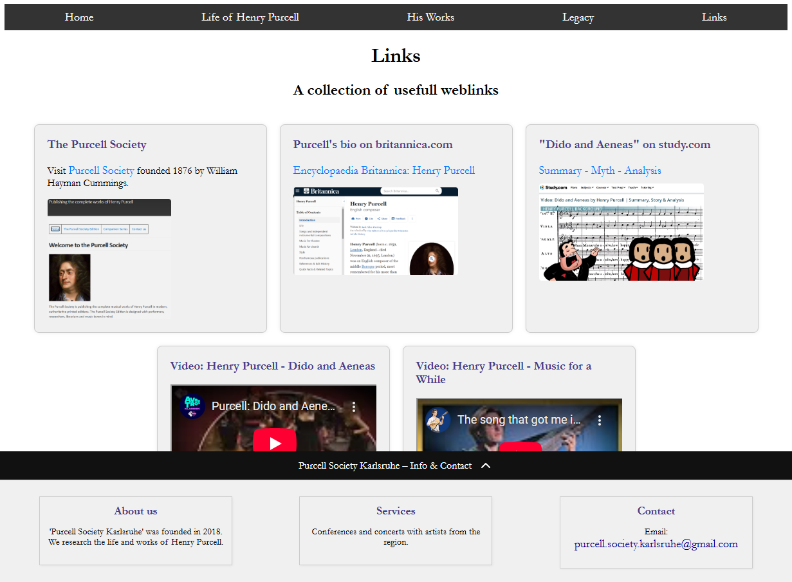
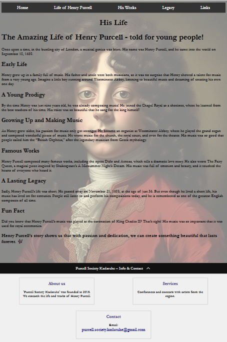
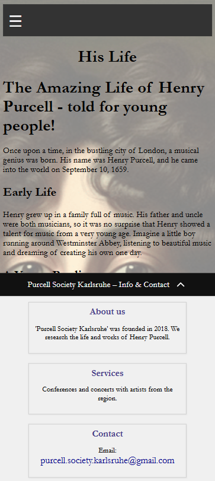

# Purcell Society Karlsruhe - Portfolio Project 1

## Project Overview

This website is dedicated to Henry Purcell and the Purcell Society Karlsruhe.  
It contains a home page with an immersive hero section, teaser boxes leading to more detailed pages, and a smart collapsible footer for information and contact.  
The site is fully responsive and adjusts to various screen sizes.

## Features

- **Hero Section**: Full-screen background image with overlayed text and an explore button.
- **Teaser Section**: Animated boxes linking to key parts of the website.
- **Smart Footer**: Fixed collapsible footer for about, services, and contact information.
- **Responsive Design**: Optimized for desktop, tablet, and mobile screens.
- **External Links**: Open in a new tab (`target="_blank"` with `rel="noopener noreferrer"`) for improved user experience and security.

## Screenshots

Below are some impressions of the website on different devices:

### Homepage - Start (Desktop)

### Homepage - Explore Button (Desktop)

### Life Page (Desktop)

### Works Page (Desktop)

### Legacy Page (Desktop)

### Links Page (Desktop)

---

### Smart Footer (Expanded) on links page

---

### Responsive Design (life.html) - Tablet View

### Responsive Design (life.html)- Smartphone View

## Technologies Used

- HTML5
- CSS3 (with custom responsive adjustments)
- Visual Studio Code
- Git & GitHub for version control

## Special Notes

- The **Wikipedia link** for Purcell's compositions opens in a **new tab** to prevent disrupting the user session and for security purposes.
- Personal, slightly experimental CSS comments have been used to make the development process authentic and traceable.

## Deployment

This website was deployed using **GitHub Pages**:

- The project repository is hosted on [GitHub](https://github.com/freewimoe/PP1-resub).
- The live site is available at: [https://freewimoe.github.io/PP1-resub/](https://freewimoe.github.io/PP1-resub/)

### Steps for Deployment:
1. Go to the repository on GitHub.
2. Click on **Settings** → **Pages**.
3. Under **Source**, select the **main** branch and **/ (root)** folder.
4. Click **Save**.
5. After a few seconds, the site is published and available at the provided URL.

---

## Acknowledgments

Thanks to Code Institute and the open source community for providing the learning resources that made this project possible.

---

*(c) 2025 Purcell Society Karlsruhe*